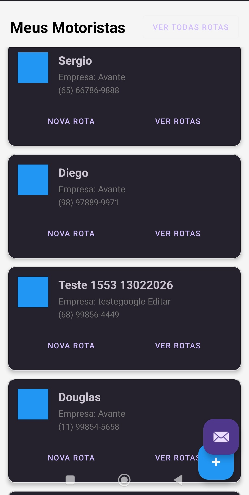
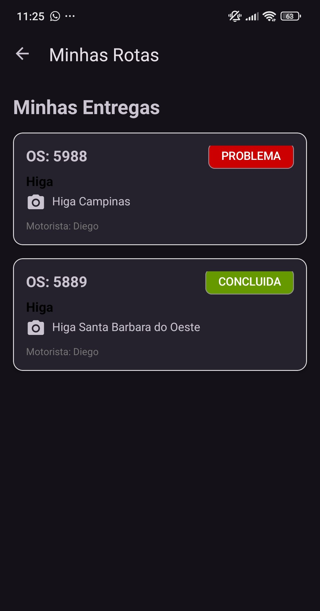
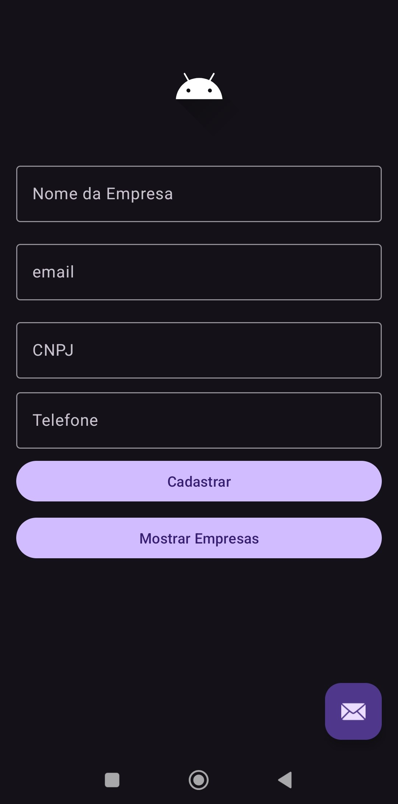
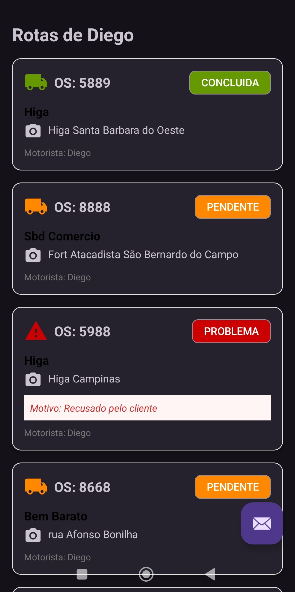
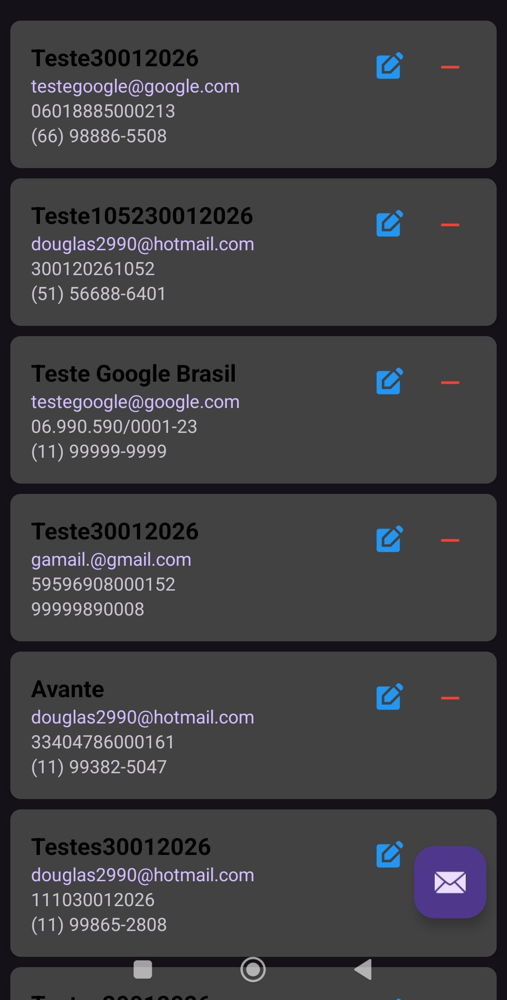
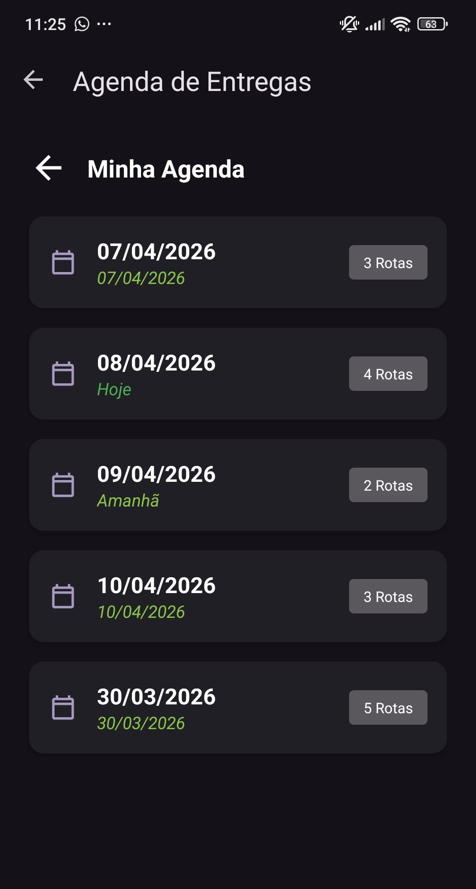
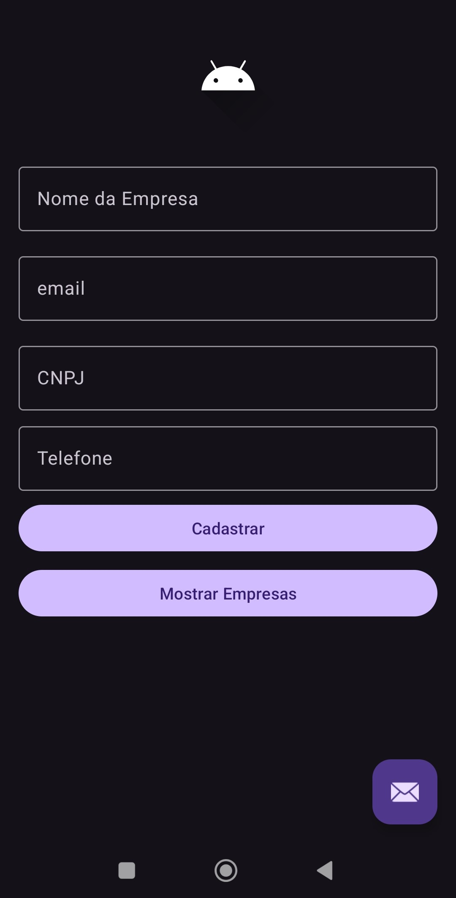
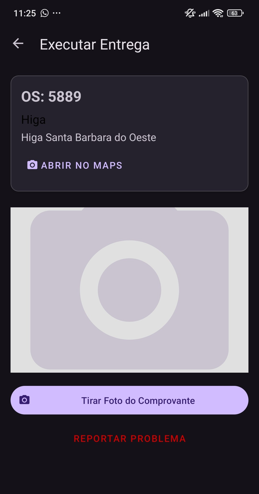

# 🚚 Logística Express - Sistema de Gestão de Entregas

Sistema multi-módulo desenvolvido para gestão logística, permitindo que administradores gerenciem rotas e motoristas realizem entregas com comprovação em tempo real.

## 📱 O Projeto
O ecossistema é dividido em dois aplicativos principais integrados via Firebase:
- **App Administrador:** Cadastro de ordens de serviço (OS), monitoramento de status e gestão de motoristas.
- **App Motorista:** Visualização de rotas diárias, atualização de status e envio de comprovantes de entrega.

## 🏗️ Arquitetura e Boas Práticas
Para garantir a escalabilidade e testabilidade do sistema, utilizei os princípios da **Clean Architecture** dividindo o projeto em camadas:
- **Data:** Implementação de repositórios, fontes de dados (Remote/Local) e DTOs.
- **Domain:** Regras de negócio puras, Use Cases e interfaces de repositórios.
- **UI (Presentation):** Fragments e ViewModels seguindo o padrão **MVVM**.
- **Core (Common):** Módulo compartilhado com utilitários, extensões e modelos de dados comuns.

## 🛠️ Tecnologias Utilizadas
- **Linguagem:** [Kotlin](https://kotlinlang.org/)
- **Injeção de Dependência:** [Dagger Hilt](https://dagger.dev/hilt/)
- **Banco de Dados Local:** [Room](https://developer.android.com/training/data-storage/room)
-  futuro do projeto  ---->   **Rede:** [Retrofit](https://square.github.io/retrofit/) & [OkHttp](https://square.github.io/okhttp/)
- **Backend:** [Firebase](https://firebase.google.com/) (Auth, Firestore, Storage)
- **Assincronismo:** [Kotlin Coroutines](https://kotlinlang.org/docs/coroutines-overview.html) & Flow
- **UI:** View Binding e Fragments de navegação.

## 🚀 Como Executar o Projeto
1. Clone este repositório.
2. Como este projeto utiliza o Firebase, você precisará criar um projeto no [Console do Firebase](https://console.firebase.google.com/).
3. Adicione os arquivos `google-services.json` nas pastas `app_admin/` e `app_motorista/`.
4. Sincronize o Gradle e execute o app.

## 🛡️ Segurança
Os arquivos de configuração do Firebase (`google-services.json`) foram omitidos deste repositório por questões de segurança, seguindo as melhores práticas de desenvolvimento.

## 📸 Demonstração do App

| App Administrador                                   | App Motorista                                                                                              |
|-----------------------------------------------------|------------------------------------------------------------------------------------------------------------|
|  |                                                         |
|  |                                                         |
|  |                                                         |
|  |                                                         |

> **Nota:** Os prints acima demonstram o fluxo de gestão de ordens de serviço e a agenda de rotas do motorista.

---
Desenvolvido por [Douglas](https://github.com/douglas2990)
https://www.linkedin.com/in/douglas-sousa-de-oliveira-775a50b3/
